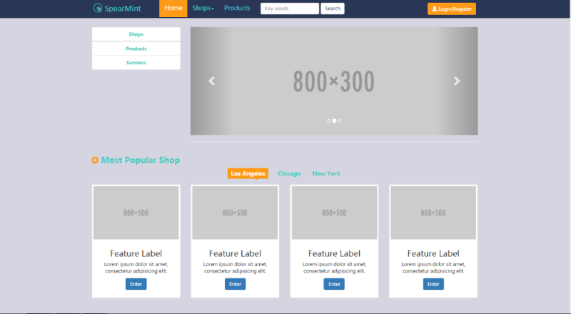
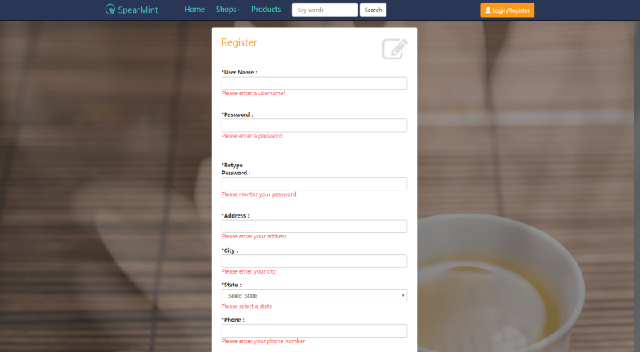
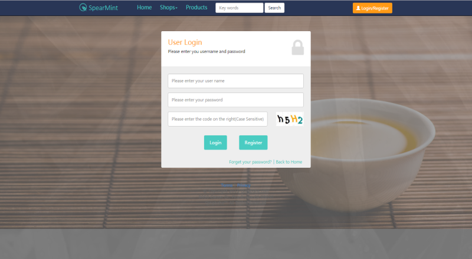
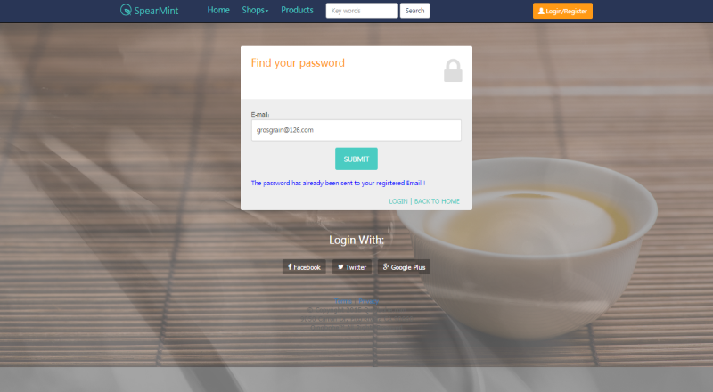
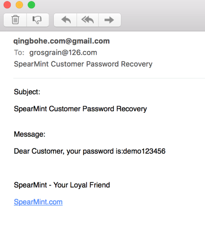
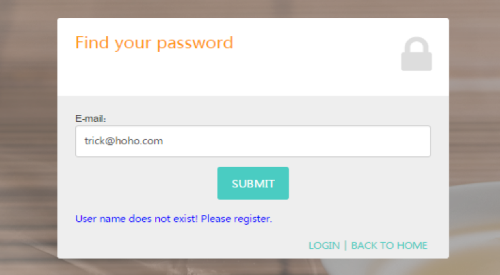
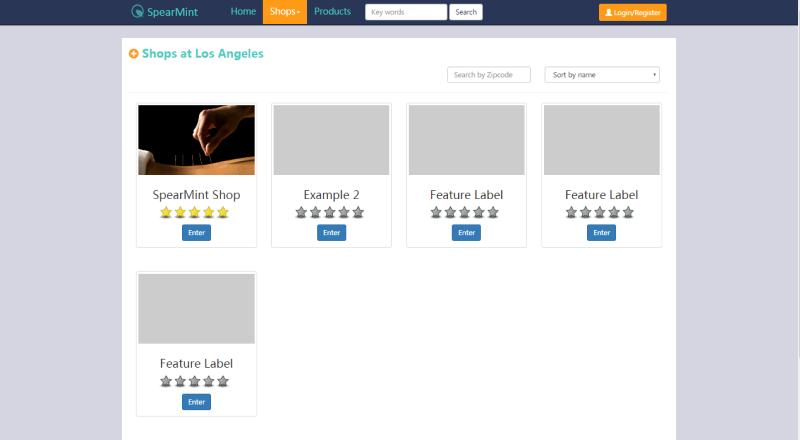
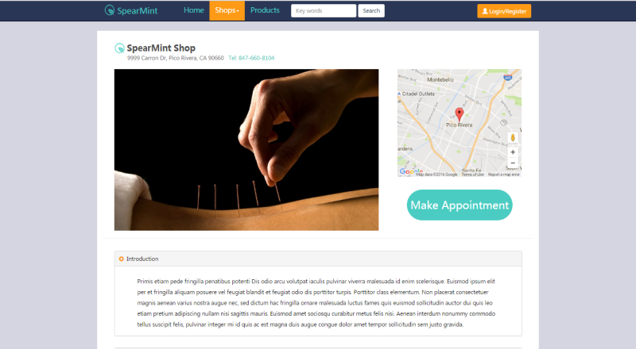
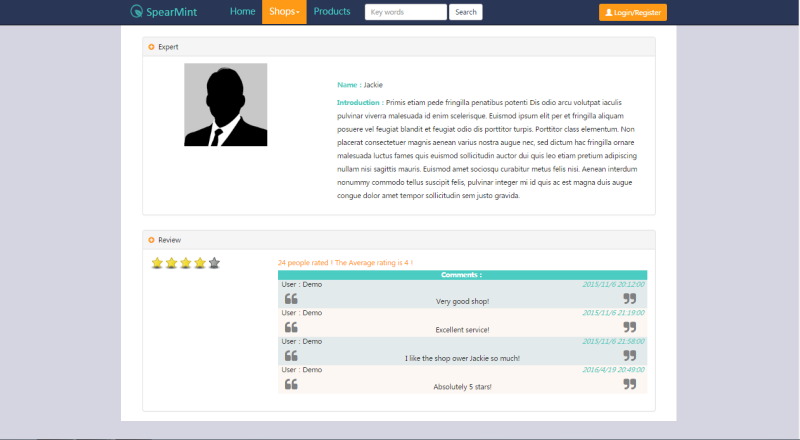
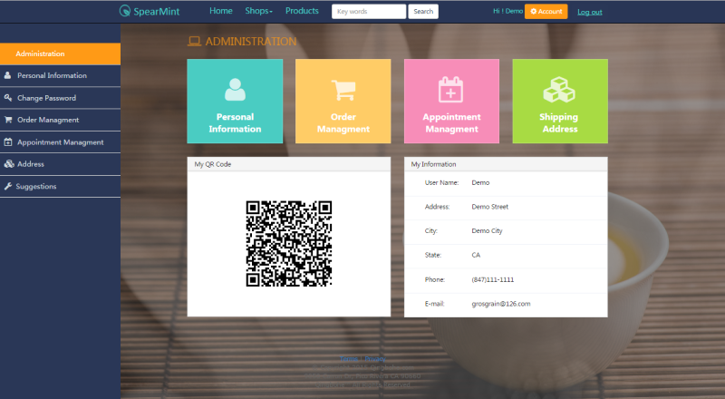

# SpearMint

SpearMint is a responsive C# ASP.NET website template which includes basic functions of user register, login, edit personal information, rating and making comments. All data are stored in local MS SQL database. It is also mobile-friendly.

### Home Page

Home page has fixed navigation bar on the top. Image carousel is used to display advertisement.

### Register Page

Validation has been enabled in register page.

### Login Page

Login page contains security code, which is case sensitive.

### Password Recovery

User will be directed to password recovery page by clicking "Forget your password?" on login page.

A email that include the user's password would be sent to user's registered email address.

If the email address is not in the data base. An erro message will show up.

### Shop Section

By clicking "Shop" on navigation bar, user will be directed to shop section.

In order to explain the design concept of SpearMint template. We created a sample shop called SpearMint Shop.

Google maps are embeded in the sample page.

The sample page could also enable users to make comments and rating. You could check demo.aspx in C#_ASP.NET file for details.

### Administration Section

After user loging in, the user could check and edit personal information by clicking "Account" button on navigation bar.

In this section, user could edit personal information, check order status, give feedback to the website etc. 

A QR code is also generated to store user ID in order to enable users to share their ID to others.

